# Reading-Notes
This site is designed to help me keep track of my observations and questions from the reading assignments throughout my course. It provides a convenient platform where I can organize and store my thoughts in one place. With this site, I can easily refer back to my notes and reflections whenever I need them, ensuring that I effectively manage my learning process. It's a valuable tool that allows me to stay organized and have a record of my insights and inquiries for future reference.

## Code 102 - Intro to Software Development
What we have learned here:
1. HTML
2. CSS
3. JS
4. ReactJs
5. NodeJs
6. postgresql

Used tools:
* [railway](https://railway.app/)
* [dashboard.render](https://dashboard.render.com/login)
* [netlfiy](https://www.netlify.com/)

**platforms for management**: `Trello, Discord, Slack.`

And we have made the final project successfully. :shipit:  
here is the link for the [Final Project](https://aesthetic-phoenix-14d146.netlify.app/)

## Code 401 - Advanced Software Development

### SQL Practice
Throughout the lessons on relational databases and SQL, I have gained a comprehensive understanding of key concepts and techniques. I started with an introduction to SQL and learned about the fundamentals of SELECT queries, including filtering and sorting query results. The lessons on queries with constraints deepened my knowledge by exploring various conditions and logical operators to retrieve specific data. Multi-table queries with JOINs enabled me to work with multiple tables simultaneously, combining related data as needed.

I also learned about data manipulation, including inserting new rows into tables, updating existing data, and deleting specific rows when necessary. Understanding how to create tables and modify their structure using the ALTER TABLE statement expanded my skills in managing the database schema. Finally, I explored the process of dropping tables, effectively removing them from the database.

By covering these topics, I have developed a solid foundation in SQL and relational databases. This knowledge will empower me to work efficiently with data, retrieve specific information, manipulate tables, and perform various database operations. As I continue to explore and practice SQL, I will be equipped with the necessary skills to work effectively with relational databases in real-world scenarios.

 

***SQLBOLT Pictures***

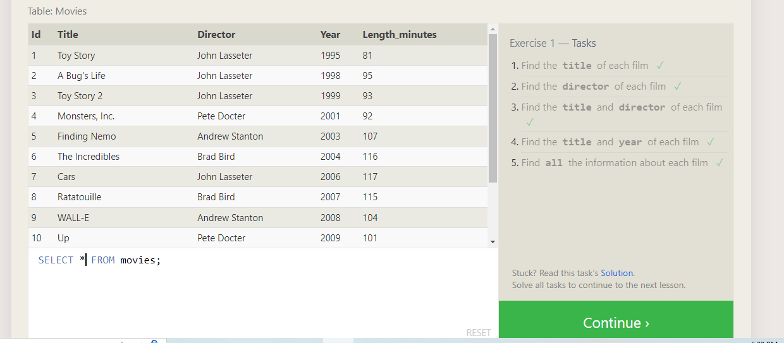
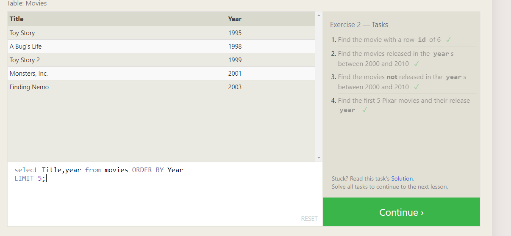
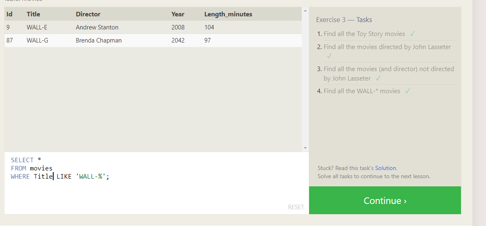
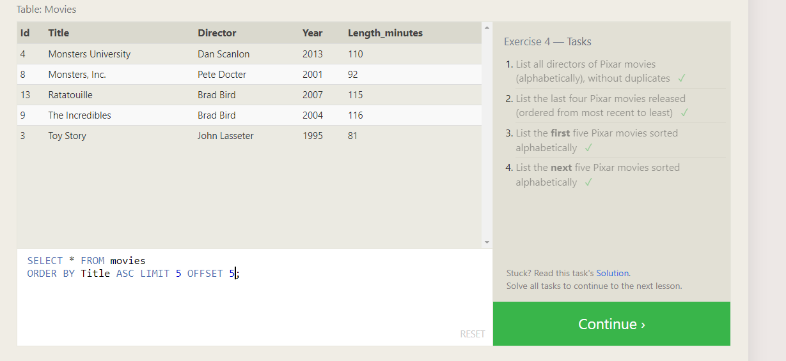

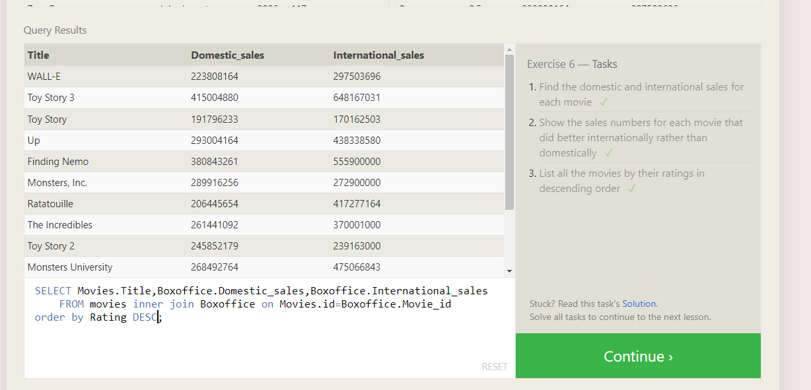
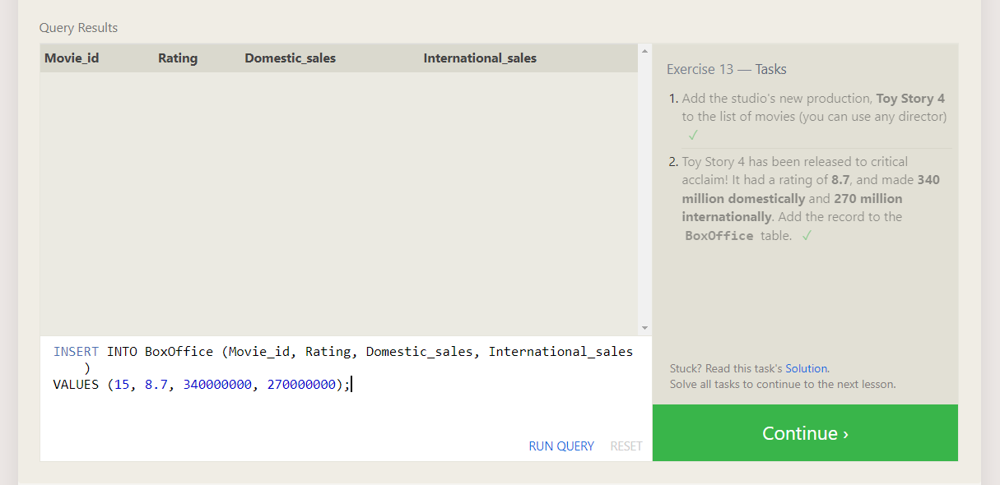
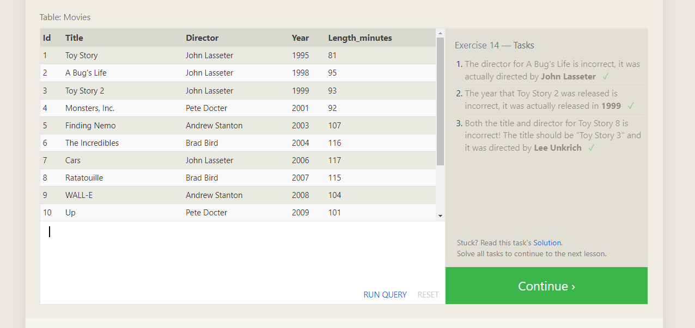
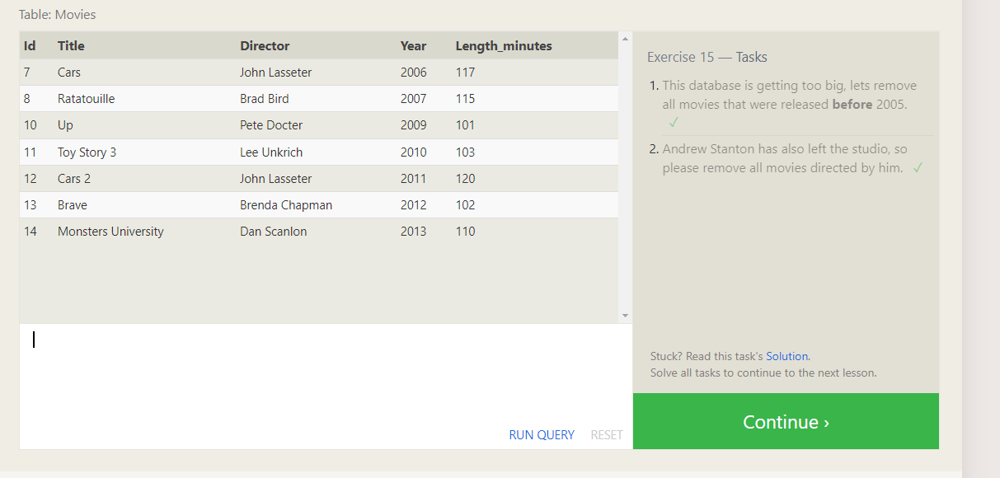
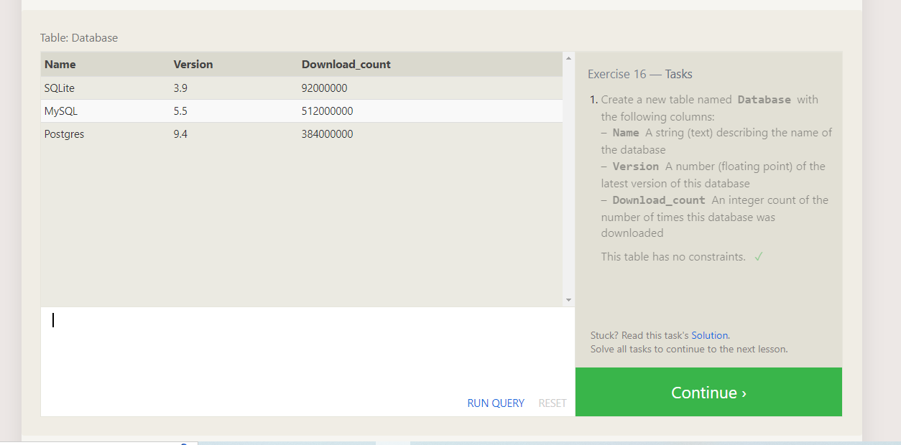
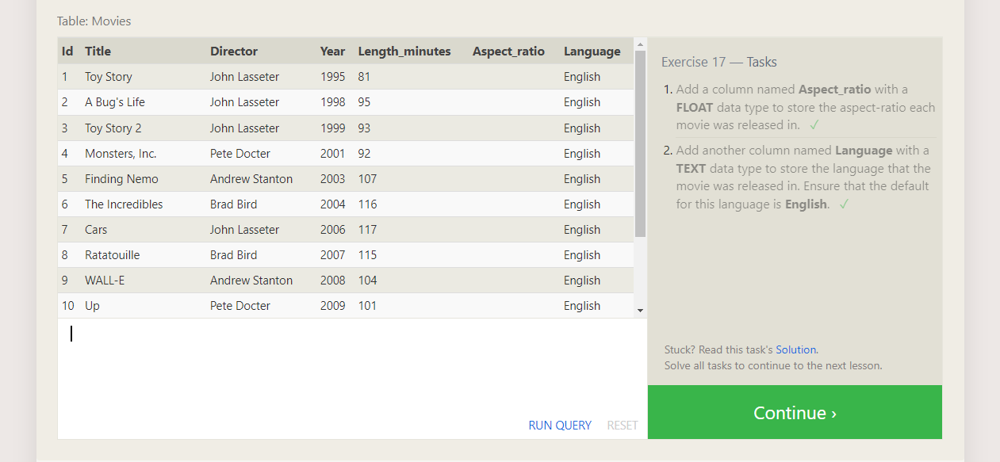
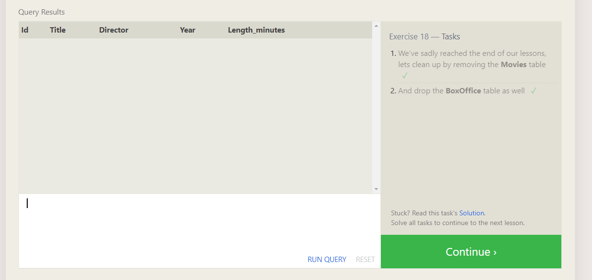

---
